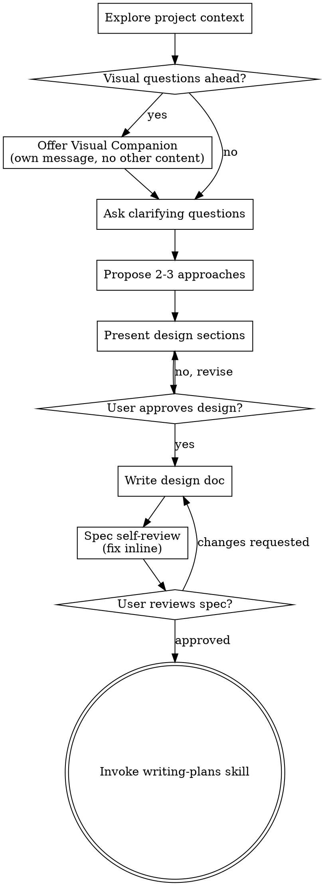

# 将想法头脑风暴成设计

通过自然的协作对话，帮助将想法转化为完整成形的设计和规格。

先理解当前项目上下文，然后一次问一个问题来细化想法。一旦你理解要构建什么，展示设计并获得用户批准。

<HARD-GATE>
在你展示设计并且用户批准之前，不要调用任何实现技能、编写任何代码、脚手架任何项目，或采取任何实现行动。这适用于每个项目，无论它看起来多简单。
</HARD-GATE>

## 反模式：“这太简单，不需要设计”

每个项目都要经过这个流程。Todo list、单函数工具、配置变更 — 全都一样。“简单”项目最容易因为未经检查的假设造成最多浪费。设计可以很短（真正简单的项目只需几句话），但你必须展示它并获得批准。

## 检查清单

你必须为这些项目各创建一个任务，并按顺序完成：

1. **探索项目上下文** — 检查文件、文档、最近提交
2. **提供视觉伴侣**（如果主题会涉及视觉问题）— 这是独立消息，不与澄清问题组合。见下方 Visual Companion 章节。
3. **询问澄清问题** — 一次一个，理解目的/约束/成功标准
4. **提出 2-3 种方法** — 包含权衡和你的推荐
5. **展示设计** — 按复杂度缩放章节，每节后获得用户批准
6. **编写设计文档** — 保存到 `docs/superpowers/specs/YYYY-MM-DD-<topic>-design.md` 并提交
7. **规格自我审查** — 快速 inline 检查占位符、矛盾、歧义、范围（见下方）
8. **用户审查书面规格** — 在继续前请用户审查规格文件
9. **过渡到实现** — 调用 writing-plans 技能创建实现计划

## 流程图

**终止状态是调用 writing-plans。**不要调用 frontend-design、mcp-builder 或任何其他实现技能。brainstorming 后你调用的唯一技能是 writing-plans。

## 流程

**理解想法：**

- 先查看当前项目状态（文件、文档、最近提交）
- 在询问详细问题前，评估范围：如果请求描述多个独立子系统（例如“build a platform with chat, file storage, billing, and analytics”），立即标记这一点。不要花问题去细化一个需要先拆分的项目细节。
- 如果项目太大，无法放进单个规格，帮助用户拆分成子项目：独立部分是什么，它们如何相关，应该按什么顺序构建？然后通过正常设计流程头脑风暴第一个子项目。每个子项目都有自己的 spec → plan → implementation 周期。
- 对于范围合适的项目，一次问一个问题来细化想法
- 尽可能偏好多选问题，但开放式问题也可以
- 每条消息只问一个问题 - 如果一个主题需要更多探索，把它拆成多个问题
- 专注于理解：目的、约束、成功标准

**探索方法：**

- 提出 2-3 种不同方法及其权衡
- 以对话方式展示选项，包含你的推荐和理由
- 先展示你的推荐选项，并解释原因

**展示设计：**

- 一旦你认为理解了要构建什么，展示设计
- 根据复杂度缩放每个章节：简单时几句话，细微复杂时最多 200-300 词
- 每节后询问目前是否正确
- 覆盖：架构、组件、数据流、错误处理、测试
- 如果有东西不合理，准备回头澄清

**为隔离和清晰而设计：**

- 将系统拆成更小单元，每个单元有一个清晰目的，通过定义良好的接口通信，并且可以独立理解和测试
- 对每个单元，你应该能回答：它做什么、如何使用它、它依赖什么？
- 有人能否不读内部实现就理解一个单元做什么？你能否修改内部实现而不破坏使用者？如果不能，边界需要改进。
- 更小、边界良好的单元也更容易让你工作 - 你更擅长推理能一次装进上下文的代码，并且当文件聚焦时，你的编辑更可靠。当一个文件变大时，这通常表示它做得太多。

**在现有代码库中工作：**

- 提出变更前探索当前结构。遵循现有模式。
- 当现有代码的问题影响工作时（例如文件变得太大、边界不清、职责纠缠），将有针对性的改进纳入设计 - 就像优秀开发者会改进自己正在处理的代码。
- 不要提出无关重构。专注于服务当前目标的内容。

## 设计之后

**文档：**

- 将已验证的设计（spec）写入 `docs/superpowers/specs/YYYY-MM-DD-<topic>-design.md`
  - （用户对 spec 位置的偏好覆盖此默认值）
- 如果可用，使用 elements-of-style:writing-clearly-and-concisely 技能
- 将设计文档提交到 git

**规格自我审查：**
写完规格文档后，用新鲜视角查看它：

1. **占位符扫描：**是否有“TBD”、“TODO”、不完整章节或含糊需求？修复它们。
2. **内部一致性：**是否有章节相互矛盾？架构是否匹配功能描述？
3. **范围检查：**这是否足够聚焦于单个实现计划，还是需要拆分？
4. **歧义检查：**是否有任何需求可以被两种不同方式解释？如果有，选择一种并明确写出。

内联修复任何问题。不需要重新审查 — 直接修复并继续。

**用户审查关卡：**
规格审查循环通过后，请用户在继续前审查书面规格：

> “Spec written and committed to `<path>`. Please review it and let me know if you want to make any changes before we start writing out the implementation plan.”

等待用户响应。如果他们请求变更，进行变更并重新运行规格审查循环。只有用户批准后才继续。

**实现：**

- 调用 writing-plans 技能来创建详细实现计划
- 不要调用任何其他技能。writing-plans 是下一步。

## 关键原则

- **一次一个问题** - 不要用多个问题压垮对方
- **偏好多选** - 可行时比开放式更容易回答
- **无情 YAGNI** - 从所有设计中移除不必要功能
- **探索替代方案** - 在定案前总是提出 2-3 种方法
- **增量验证** - 展示设计，获得批准后再继续
- **保持灵活** - 当某些东西不合理时，回头澄清

## Visual Companion

一个基于浏览器的伴侣，用于在 brainstorming 期间展示 mockups、diagrams 和 visual options。它作为工具可用 — 不是模式。接受伴侣意味着它可用于受益于视觉处理的问题；不意味着每个问题都通过浏览器。

**提供伴侣：**当你预期接下来的问题会涉及视觉内容（mockups、layouts、diagrams）时，先请求一次同意：
> “Some of what we're working on might be easier to explain if I can show it to you in a web browser. I can put together mockups, diagrams, comparisons, and other visuals as we go. This feature is still new and can be token-intensive. Want to try it? (Requires opening a local URL)”

**这个提议必须是自己的消息。**不要将它与澄清问题、上下文摘要或任何其他内容组合。消息应该只包含上面的提议，什么都不要加。继续前等待用户响应。如果他们拒绝，继续纯文本 brainstorming。

**逐问题决策：**即使用户接受，也要对每个问题决定使用浏览器还是终端。测试标准：**用户看到它是否比阅读它更容易理解？**

- **使用浏览器**处理视觉内容 — mockups、wireframes、layout comparisons、architecture diagrams、side-by-side visual designs
- **使用终端**处理文本内容 — requirements questions、conceptual choices、tradeoff lists、A/B/C/D text options、scope decisions

关于 UI 主题的问题不自动等于视觉问题。“What does personality mean in this context?” 是概念问题 — 使用终端。“Which wizard layout works better?” 是视觉问题 — 使用浏览器。

如果他们同意伴侣，继续前阅读详细指南：
`skills/brainstorming/visual-companion.md`
