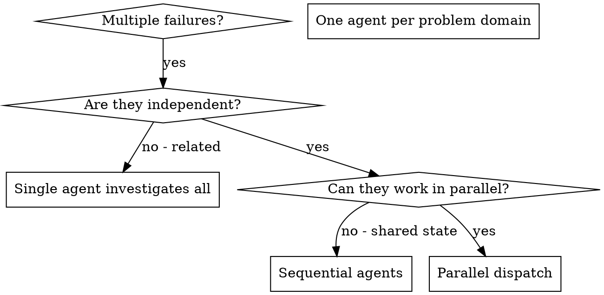

# 派发并行 Agents

## 概述

你将任务委派给具有隔离上下文的专门 agent。通过精确构造它们的指令和上下文，你确保它们保持专注并成功完成任务。它们绝不应该继承你的会话上下文或历史 — 你只构造它们需要的内容。这也为你保留用于协调工作的上下文。

当你有多个无关失败（不同测试文件、不同子系统、不同 bug）时，顺序调查它们会浪费时间。每个调查都是独立的，可以并行发生。

**核心原则：**每个独立问题域派发一个 agent。让它们并发工作。

## 何时使用



**在以下情况使用：**
- 3 个以上测试文件因不同根因失败
- 多个子系统独立损坏
- 每个问题都能在没有其他问题上下文的情况下理解
- 调查之间没有共享状态

**不要在以下情况使用：**
- 失败相关（修复一个可能修复其他）
- 需要理解完整系统状态
- Agent 会相互干扰

## 模式

### 1. 识别独立领域

按损坏内容对失败分组：
- File A tests: Tool approval flow
- File B tests: Batch completion behavior
- File C tests: Abort functionality

每个领域都是独立的 - 修复 tool approval 不会影响 abort tests。

### 2. 创建聚焦的 Agent 任务

每个 agent 获得：
- **具体范围：**一个测试文件或子系统
- **清晰目标：**让这些测试通过
- **约束：**不要修改其他代码
- **预期输出：**你发现和修复内容的摘要

### 3. 并行派发

```typescript
// In Claude Code / AI environment
Task("Fix agent-tool-abort.test.ts failures")
Task("Fix batch-completion-behavior.test.ts failures")
Task("Fix tool-approval-race-conditions.test.ts failures")
// All three run concurrently
```

### 4. 审查并集成

当 agents 返回时：
- 阅读每个摘要
- 验证修复不会冲突
- 运行完整测试套件
- 集成所有变更

## Agent 提示结构

好的 agent 提示是：
1. **聚焦** - 一个清晰的问题域
2. **自包含** - 包含理解问题所需的所有上下文
3. **具体说明输出** - agent 应该返回什么？

```markdown
Fix the 3 failing tests in src/agents/agent-tool-abort.test.ts:

1. "should abort tool with partial output capture" - expects 'interrupted at' in message
2. "should handle mixed completed and aborted tools" - fast tool aborted instead of completed
3. "should properly track pendingToolCount" - expects 3 results but gets 0

These are timing/race condition issues. Your task:

1. Read the test file and understand what each test verifies
2. Identify root cause - timing issues or actual bugs?
3. Fix by:
   - Replacing arbitrary timeouts with event-based waiting
   - Fixing bugs in abort implementation if found
   - Adjusting test expectations if testing changed behavior

Do NOT just increase timeouts - find the real issue.

Return: Summary of what you found and what you fixed.
```

## 常见错误

**❌ 太宽泛：**“Fix all the tests” - agent 会迷失
**✅ 具体：**“Fix agent-tool-abort.test.ts” - 范围聚焦

**❌ 没有上下文：**“Fix the race condition” - agent 不知道在哪里
**✅ 上下文：**粘贴错误消息和测试名称

**❌ 没有约束：**Agent 可能重构一切
**✅ 约束：**“Do NOT change production code” 或 “Fix tests only”

**❌ 输出含糊：**“Fix it” - 你不知道改了什么
**✅ 具体：**“Return summary of root cause and changes”

## 何时不要使用

**相关失败：**修复一个可能修复其他 - 先一起调查
**需要完整上下文：**理解需要看到整个系统
**探索性调试：**你还不知道哪里坏了
**共享状态：**Agents 会相互干扰（编辑相同文件、使用相同资源）

## 会话中的真实示例

**场景：**重大重构后，3 个文件中有 6 个测试失败

**失败：**
- agent-tool-abort.test.ts: 3 failures（timing issues）
- batch-completion-behavior.test.ts: 2 failures（tools not executing）
- tool-approval-race-conditions.test.ts: 1 failure（execution count = 0）

**决策：**独立领域 - abort logic 与 batch completion、race conditions 分离

**派发：**
```
Agent 1 → Fix agent-tool-abort.test.ts
Agent 2 → Fix batch-completion-behavior.test.ts
Agent 3 → Fix tool-approval-race-conditions.test.ts
```

**结果：**
- Agent 1: Replaced timeouts with event-based waiting
- Agent 2: Fixed event structure bug (threadId in wrong place)
- Agent 3: Added wait for async tool execution to complete

**集成：**所有修复彼此独立，无冲突，完整套件 green

**节省时间：**3 个问题并行解决，而不是顺序解决

## 关键收益

1. **并行化** - 多个调查同时发生
2. **聚焦** - 每个 agent 范围狭窄，要跟踪的上下文更少
3. **独立性** - Agents 不会相互干扰
4. **速度** - 用 1 个问题的时间解决 3 个问题

## 验证

Agents 返回后：
1. **审查每个摘要** - 理解改了什么
2. **检查冲突** - Agents 是否编辑了相同代码？
3. **运行完整套件** - 验证所有修复一起工作
4. **抽查** - Agents 可能犯系统性错误

## 真实世界影响

来自调试会话（2025-10-03）：
- 3 个文件中 6 个失败
- 3 个 agents 并行派发
- 所有调查并发完成
- 所有修复成功集成
- Agent 变更之间零冲突
