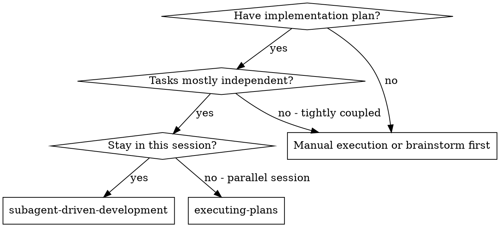
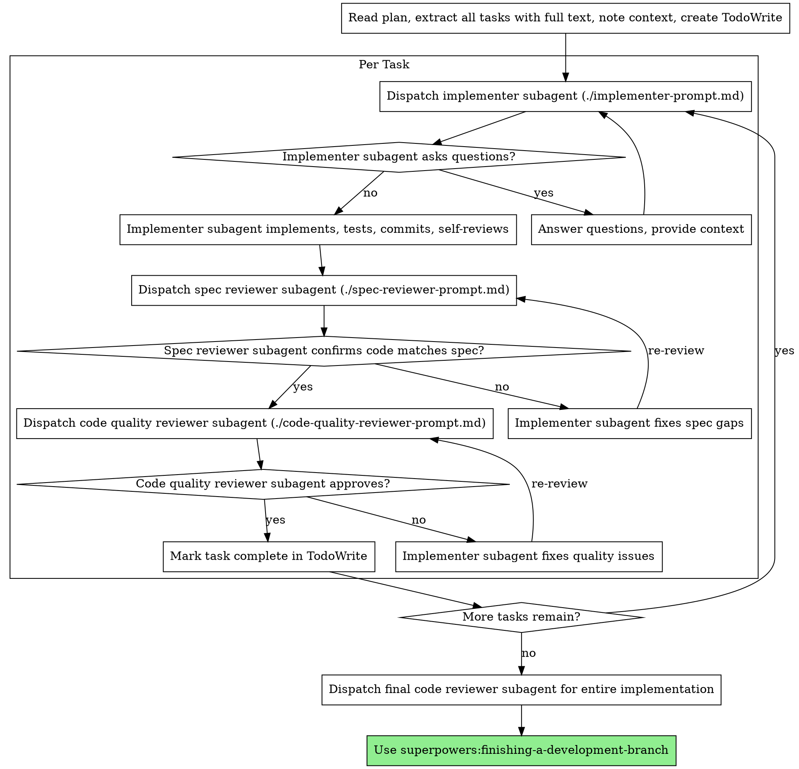

# Subagent-Driven Development

通过为每个任务派发新的 subagent 来执行计划，并在每个任务后进行两阶段审查：先做规格合规审查，再做代码质量审查。

**为什么使用 subagents：**你将任务委派给具有隔离上下文的专门 agent。通过精确构造它们的指令和上下文，你确保它们保持专注并成功完成任务。它们绝不应该继承你的会话上下文或历史 — 你只构造它们需要的内容。这也为你保留用于协调工作的上下文。

**核心原则：**每个任务一个新的 subagent + 两阶段审查（先规格，再质量）= 高质量、快速迭代

**持续执行：**不要在任务之间暂停并向你的人类伙伴确认。执行计划中的所有任务，不要停止。唯一停止理由是：你无法解决的 BLOCKED 状态、真正阻止进展的歧义，或所有任务完成。“Should I continue?” 提示和进度摘要会浪费他们的时间 — 他们要求你执行计划，所以执行它。

## 何时使用



**相较 Executing Plans（并行会话）：**
- 同一会话（无上下文切换）
- 每个任务新的 subagent（无上下文污染）
- 每个任务后两阶段审查：先规格合规，再代码质量
- 更快迭代（任务间无需 human-in-loop）

## 流程



## 模型选择

使用能处理每个角色的最低能力模型，以节省成本并提高速度。

**机械实现任务**（隔离函数、清晰规格、1-2 个文件）：使用快速、便宜的模型。当计划写得足够明确时，大多数实现任务都是机械性的。

**集成和判断任务**（多文件协调、模式匹配、调试）：使用标准模型。

**架构、设计和审查任务**：使用可用的最强模型。

**任务复杂度信号：**
- 触碰 1-2 个文件且有完整规格 → 便宜模型
- 触碰多个文件且有集成关注点 → 标准模型
- 需要设计判断或广泛代码库理解 → 最强模型

## 处理实现者状态

实现者 subagents 会报告四种状态之一。相应处理每种状态：

**DONE：**继续进行规格合规审查。

**DONE_WITH_CONCERNS：**实现者完成了工作但标记了疑虑。继续前阅读这些疑虑。如果疑虑关于正确性或范围，在审查前处理它们。如果它们只是观察（例如“this file is getting large”），记录并继续审查。

**NEEDS_CONTEXT：**实现者需要未提供的信息。提供缺失上下文并重新派发。

**BLOCKED：**实现者无法完成任务。评估阻塞：
1. 如果是上下文问题，提供更多上下文并用相同模型重新派发
2. 如果任务需要更多推理，用更强模型重新派发
3. 如果任务太大，将它拆成更小部分
4. 如果计划本身错误，升级给人类

**绝不要**忽略升级，或在没有变化的情况下强迫同一个模型重试。如果实现者说它卡住了，就需要改变某些东西。

## 提示模板

- `./implementer-prompt.md` - 派发实现者 subagent
- `./spec-reviewer-prompt.md` - 派发规格合规审查者 subagent
- `./code-quality-reviewer-prompt.md` - 派发代码质量审查者 subagent

## 示例工作流

```
You: I'm using Subagent-Driven Development to execute this plan.

[Read plan file once: docs/superpowers/plans/feature-plan.md]
[Extract all 5 tasks with full text and context]
[Create TodoWrite with all tasks]

Task 1: Hook installation script

[Get Task 1 text and context (already extracted)]
[Dispatch implementation subagent with full task text + context]

Implementer: "Before I begin - should the hook be installed at user or system level?"

You: "User level (~/.config/superpowers/hooks/)"

Implementer: "Got it. Implementing now..."
[Later] Implementer:
  - Implemented install-hook command
  - Added tests, 5/5 passing
  - Self-review: Found I missed --force flag, added it
  - Committed

[Dispatch spec compliance reviewer]
Spec reviewer: ✅ Spec compliant - all requirements met, nothing extra

[Get git SHAs, dispatch code quality reviewer]
Code reviewer: Strengths: Good test coverage, clean. Issues: None. Approved.

[Mark Task 1 complete]

Task 2: Recovery modes

[Get Task 2 text and context (already extracted)]
[Dispatch implementation subagent with full task text + context]

Implementer: [No questions, proceeds]
Implementer:
  - Added verify/repair modes
  - 8/8 tests passing
  - Self-review: All good
  - Committed

[Dispatch spec compliance reviewer]
Spec reviewer: ❌ Issues:
  - Missing: Progress reporting (spec says "report every 100 items")
  - Extra: Added --json flag (not requested)

[Implementer fixes issues]
Implementer: Removed --json flag, added progress reporting

[Spec reviewer reviews again]
Spec reviewer: ✅ Spec compliant now

[Dispatch code quality reviewer]
Code reviewer: Strengths: Solid. Issues (Important): Magic number (100)

[Implementer fixes]
Implementer: Extracted PROGRESS_INTERVAL constant

[Code reviewer reviews again]
Code reviewer: ✅ Approved

[Mark Task 2 complete]

...

[After all tasks]
[Dispatch final code-reviewer]
Final reviewer: All requirements met, ready to merge

Done!
```

## 优势

**相较手动执行：**
- Subagents 会自然遵循 TDD
- 每个任务新鲜上下文（没有混淆）
- 并行安全（subagents 不会相互干扰）
- Subagent 可以提问（工作前和工作期间）

**相较 Executing Plans：**
- 同一会话（无交接）
- 持续进展（无需等待）
- 自动审查检查点

**效率收益：**
- 没有文件读取开销（controller 提供完整文本）
- Controller 精心挑选所需的准确上下文
- Subagent 预先获得完整信息
- 问题在工作开始前暴露（不是之后）

**质量关卡：**
- 自我审查在交接前捕捉问题
- 两阶段审查：规格合规，然后代码质量
- 审查循环确保修复实际有效
- 规格合规防止构建过多/过少
- 代码质量确保实现构建良好

**成本：**
- 更多 subagent 调用（每个任务 implementer + 2 reviewers）
- Controller 做更多准备工作（预先提取所有任务）
- 审查循环增加迭代
- 但能早捕捉问题（比之后调试更便宜）

## 红旗

**绝不要：**
- 没有用户明确同意就在 main/master 分支上开始实现
- 跳过审查（规格合规或代码质量）
- 带着未修复问题继续
- 并行派发多个 implementation subagents（冲突）
- 让 subagent 读取计划文件（改为提供完整文本）
- 跳过场景设定上下文（subagent 需要理解任务放在哪里）
- 忽略 subagent 的问题（先回答，再让它继续）
- 接受规格合规上的“足够接近”（spec reviewer 发现问题 = 未完成）
- 跳过审查循环（reviewer 发现问题 = implementer 修复 = 再次 review）
- 让 implementer 自我审查替代实际审查（两者都需要）
- **在规格合规为 ✅ 之前开始代码质量审查**（顺序错误）
- 当任一审查有开放问题时进入下一个任务

**如果 subagent 提问：**
- 清楚且完整地回答
- 如果需要，提供额外上下文
- 不要催促它们进入实现

**如果审查者发现问题：**
- 实现者（同一个 subagent）修复它们
- 审查者再次审查
- 重复直到批准
- 不要跳过重新审查

**如果 subagent 任务失败：**
- 使用具体指令派发 fix subagent
- 不要尝试手动修复（上下文污染）

## 集成

**必需工作流技能：**
- **superpowers:using-git-worktrees** - 确保隔离工作区（创建一个或验证已有）
- **superpowers:writing-plans** - 创建本技能执行的计划
- **superpowers:requesting-code-review** - reviewer subagents 的代码审查模板
- **superpowers:finishing-a-development-branch** - 所有任务后完成开发

**Subagents 应该使用：**
- **superpowers:test-driven-development** - Subagents 对每个任务遵循 TDD

**替代工作流：**
- **superpowers:executing-plans** - 用于并行会话而不是同会话执行
