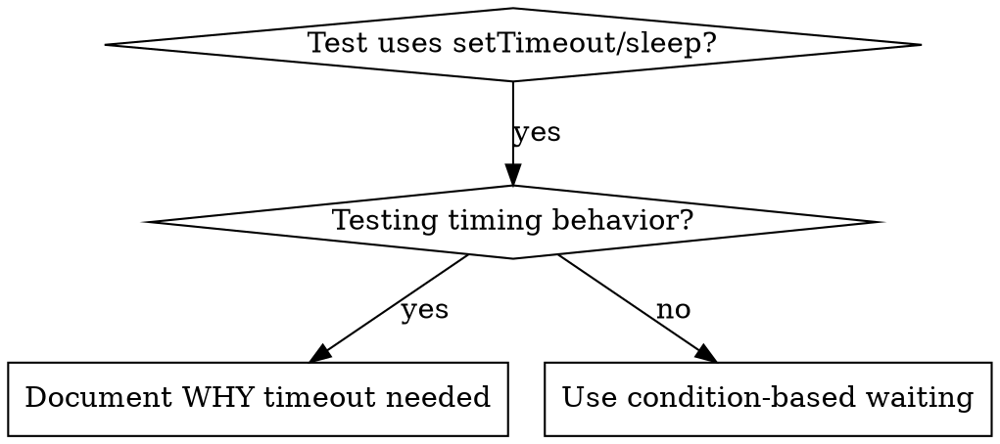

# 基于条件的等待

## 概述

Flaky tests 经常用任意延迟来猜测时序。这会创建 race conditions，使测试在快机器上通过，但在负载下或 CI 中失败。

**核心原则：**等待你真正关心的实际条件，而不是猜测它需要多久。

## 何时使用



**在以下情况使用：**
- 测试有任意延迟（`setTimeout`、`sleep`、`time.sleep()`）
- 测试 flaky（有时通过，负载下失败）
- 并行运行时测试 timeout
- 等待 async operations 完成

**不要在以下情况使用：**
- 测试实际 timing behavior（debounce、throttle intervals）
- 如果使用任意 timeout，始终记录为什么

## 核心模式

```typescript
// ❌ BEFORE: Guessing at timing
await new Promise(r => setTimeout(r, 50));
const result = getResult();
expect(result).toBeDefined();

// ✅ AFTER: Waiting for condition
await waitFor(() => getResult() !== undefined);
const result = getResult();
expect(result).toBeDefined();
```

## 快速模式

| 场景 | 模式 |
|----------|---------|
| 等待 event | `waitFor(() => events.find(e => e.type === 'DONE'))` |
| 等待 state | `waitFor(() => machine.state === 'ready')` |
| 等待 count | `waitFor(() => items.length >= 5)` |
| 等待 file | `waitFor(() => fs.existsSync(path))` |
| 复杂 condition | `waitFor(() => obj.ready && obj.value > 10)` |

## 实现

通用 polling function：
```typescript
async function waitFor<T>(
  condition: () => T | undefined | null | false,
  description: string,
  timeoutMs = 5000
): Promise<T> {
  const startTime = Date.now();

  while (true) {
    const result = condition();
    if (result) return result;

    if (Date.now() - startTime > timeoutMs) {
      throw new Error(`Timeout waiting for ${description} after ${timeoutMs}ms`);
    }

    await new Promise(r => setTimeout(r, 10)); // Poll every 10ms
  }
}
```

完整实现见本目录中的 `condition-based-waiting-example.ts`，其中包含来自实际调试会话的领域特定 helpers（`waitForEvent`、`waitForEventCount`、`waitForEventMatch`）。

## 常见错误

**❌ Polling 太快：**`setTimeout(check, 1)` - 浪费 CPU
**✅ 修复：**每 10ms poll 一次

**❌ 没有 timeout：**如果条件永远不满足，就无限循环
**✅ 修复：**始终包含 timeout 和清晰错误

**❌ 过期数据：**在循环前缓存 state
**✅ 修复：**在循环内调用 getter 获取新鲜数据

## 任意 Timeout 何时是正确的

```typescript
// Tool ticks every 100ms - need 2 ticks to verify partial output
await waitForEvent(manager, 'TOOL_STARTED'); // First: wait for condition
await new Promise(r => setTimeout(r, 200));   // Then: wait for timed behavior
// 200ms = 2 ticks at 100ms intervals - documented and justified
```

**要求：**
1. 先等待触发条件
2. 基于已知 timing（不是猜测）
3. 注释解释为什么

## 真实世界影响

来自调试会话（2025-10-03）：
- 修复 3 个文件中的 15 个 flaky tests
- 通过率：60% → 100%
- 执行时间：快 40%
- 不再有 race conditions
