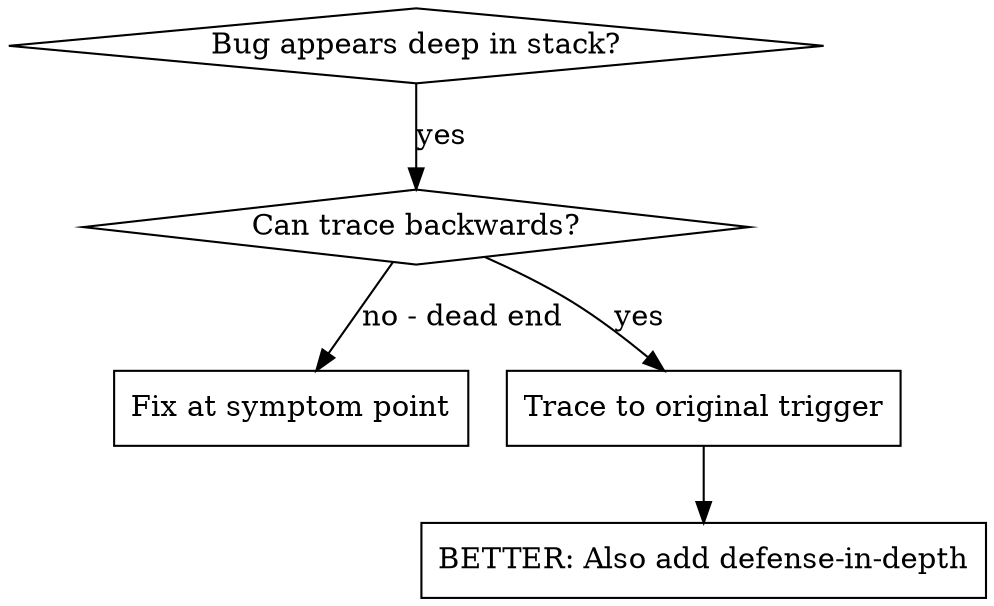
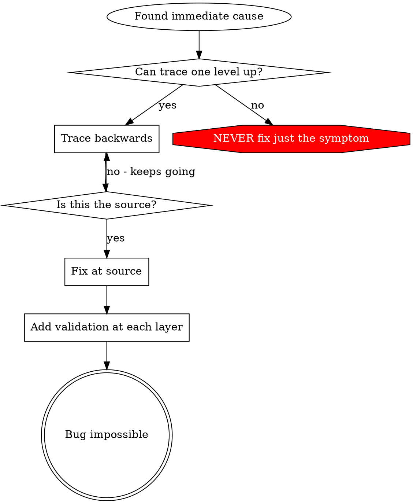

# 根因追踪

## 概述

Bugs 经常表现于调用栈深处（在错误目录 git init、文件创建在错误位置、database 用错误 path 打开）。你的本能是修复错误出现的位置，但那是在治疗症状。

**核心原则：**沿调用链向后追踪，直到找到原始触发点，然后在源头修复。

## 何时使用



**在以下情况使用：**
- 错误发生在执行深处（不在入口点）
- Stack trace 显示长调用链
- 不清楚无效数据从哪里来
- 需要找出哪个测试/代码触发问题

## 追踪流程

### 1. 观察症状
```
Error: git init failed in ~/project/packages/core
```

### 2. 找到直接原因
**什么代码直接导致这个？**
```typescript
await execFileAsync('git', ['init'], { cwd: projectDir });
```

### 3. 问：谁调用了这个？
```typescript
WorktreeManager.createSessionWorktree(projectDir, sessionId)
  → called by Session.initializeWorkspace()
  → called by Session.create()
  → called by test at Project.create()
```

### 4. 继续向上追踪
**传入了什么值？**
- `projectDir = ''`（空字符串！）
- 作为 `cwd` 的空字符串解析为 `process.cwd()`
- 那就是源代码目录！

### 5. 找到原始触发点
**空字符串从哪里来？**
```typescript
const context = setupCoreTest(); // Returns { tempDir: '' }
Project.create('name', context.tempDir); // Accessed before beforeEach!
```

## 添加 Stack Traces

当你无法手动追踪时，添加 instrumentation：

```typescript
// Before the problematic operation
async function gitInit(directory: string) {
  const stack = new Error().stack;
  console.error('DEBUG git init:', {
    directory,
    cwd: process.cwd(),
    nodeEnv: process.env.NODE_ENV,
    stack,
  });

  await execFileAsync('git', ['init'], { cwd: directory });
}
```

**关键：**在测试中使用 `console.error()`（不是 logger - 可能不会显示）

**运行并捕捉：**
```bash
npm test 2>&1 | grep 'DEBUG git init'
```

**分析 stack traces：**
- 寻找测试文件名
- 找到触发调用的行号
- 识别模式（同一个测试？同一个参数？）

## 找出哪个测试造成污染

如果某些东西在测试期间出现，但你不知道是哪个测试：

使用本目录中的 bisection script `find-polluter.sh`：

```bash
./find-polluter.sh '.git' 'src/**/*.test.ts'
```

逐个运行测试，在第一个 polluter 停止。用法见脚本。

## 真实示例：空 projectDir

**症状：**`.git` 创建在 `packages/core/`（源代码）

**追踪链：**
1. `git init` runs in `process.cwd()` ← empty cwd parameter
2. WorktreeManager called with empty projectDir
3. Session.create() passed empty string
4. Test accessed `context.tempDir` before beforeEach
5. setupCoreTest() returns `{ tempDir: '' }` initially

**根因：**顶层变量初始化访问空值

**修复：**将 tempDir 改成 getter，如果在 beforeEach 前访问就抛错

**还添加了 defense-in-depth：**
- 第 1 层：Project.create() 验证目录
- 第 2 层：WorkspaceManager 验证非空
- 第 3 层：NODE_ENV guard 拒绝在 tmpdir 外 git init
- 第 4 层：git init 前 stack trace logging

## 关键原则



**绝不要只修复错误出现的位置。**向后追踪以找到原始触发点。

## Stack Trace 提示

**在测试中：**使用 `console.error()`，不是 logger - logger 可能被抑制
**操作前：**在危险操作前 log，而不是在它失败后
**包含上下文：**Directory、cwd、environment variables、timestamps
**捕捉 stack：**`new Error().stack` 显示完整调用链

## 真实世界影响

来自调试会话（2025-10-03）：
- 通过 5 层追踪找到根因
- 在源头修复（getter validation）
- 添加 4 层 defense
- 1847 个测试通过，零污染
