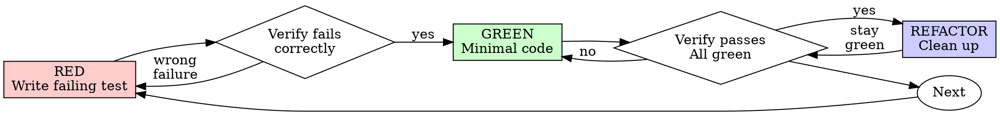

# 测试驱动开发（TDD）

## 概述

先写测试。看它失败。编写通过所需的最小代码。

**核心原则：**如果你没有看着测试失败，就不知道它是否测试了正确的东西。

**违反规则的字面要求，就是违反规则的精神。**

## 何时使用

**总是：**
- 新功能
- Bug 修复
- 重构
- 行为变更

**例外（询问你的人类伙伴）：**
- 一次性原型
- 生成代码
- 配置文件

在想“就这一次跳过 TDD”？停。那是合理化。

## 铁律

```
没有先失败的测试，就没有生产代码
```

先写了代码再写测试？删除它。重新开始。

**没有例外：**
- 不要把它保留为“参考”
- 不要在写测试时“适配”它
- 不要看它
- 删除就是删除

从测试重新实现。句号。

## Red-Green-Refactor



### RED - 编写失败测试

编写一个最小测试，展示应该发生什么。

<Good>
```typescript
test('retries failed operations 3 times', async () => {
  let attempts = 0;
  const operation = () => {
    attempts++;
    if (attempts < 3) throw new Error('fail');
    return 'success';
  };

  const result = await retryOperation(operation);

  expect(result).toBe('success');
  expect(attempts).toBe(3);
});
```
名称清晰，测试真实行为，一件事
</Good>

<Bad>
```typescript
test('retry works', async () => {
  const mock = jest.fn()
    .mockRejectedValueOnce(new Error())
    .mockRejectedValueOnce(new Error())
    .mockResolvedValueOnce('success');
  await retryOperation(mock);
  expect(mock).toHaveBeenCalledTimes(3);
});
```
名称含糊，测试 mock 而不是代码
</Bad>

**要求：**
- 一个行为
- 清晰名称
- 真实代码（除非不可避免，否则不用 mocks）

### Verify RED - 看它失败

**强制。绝不要跳过。**

```bash
npm test path/to/test.test.ts
```

确认：
- 测试失败（不是报错）
- 失败消息符合预期
- 因为功能缺失而失败（不是 typo）

**测试通过？**你正在测试已有行为。修复测试。

**测试报错？**修复错误，重新运行，直到它正确失败。

### GREEN - 最小代码

编写通过测试所需的最简单代码。

<Good>
```typescript
async function retryOperation<T>(fn: () => Promise<T>): Promise<T> {
  for (let i = 0; i < 3; i++) {
    try {
      return await fn();
    } catch (e) {
      if (i === 2) throw e;
    }
  }
  throw new Error('unreachable');
}
```
刚好足够通过
</Good>

<Bad>
```typescript
async function retryOperation<T>(
  fn: () => Promise<T>,
  options?: {
    maxRetries?: number;
    backoff?: 'linear' | 'exponential';
    onRetry?: (attempt: number) => void;
  }
): Promise<T> {
  // YAGNI
}
```
过度工程
</Bad>

不要添加功能、重构其他代码，或在测试之外“改进”。

### Verify GREEN - 看它通过

**强制。**

```bash
npm test path/to/test.test.ts
```

确认：
- 测试通过
- 其他测试仍通过
- 输出干净（没有 errors、warnings）

**测试失败？**修复代码，不是测试。

**其他测试失败？**现在修复。

### REFACTOR - 清理

只在 green 后：
- 移除重复
- 改进命名
- 提取 helpers

保持测试 green。不要添加行为。

### 重复

为下一个功能编写下一个失败测试。

## 好测试

| 质量 | 好 | 坏 |
|---------|------|-----|
| **最小** | 一件事。名称里有“and”？拆开。 | `test('validates email and domain and whitespace')` |
| **清晰** | 名称描述行为 | `test('test1')` |
| **展示意图** | 展示期望 API | 遮蔽代码应该做什么 |

## 为什么顺序重要

**“我会之后写测试来验证它有效”**

代码之后写的测试会立即通过。立即通过什么也证明不了：
- 可能测试错了东西
- 可能测试实现，而不是行为
- 可能漏掉你忘记的边界情况
- 你从未看到它抓住 bug

Test-first 强制你看到测试失败，证明它确实测试了某些东西。

**“我已经手动测试了所有边界情况”**

手动测试是 ad-hoc 的。你以为测试了一切，但：
- 没有测试内容记录
- 代码变化时无法重新运行
- 压力下容易忘记情况
- “It worked when I tried it” ≠ 全面

自动化测试是系统性的。每次都以同样方式运行。

**“删除 X 小时工作是浪费”**

沉没成本谬误。时间已经花掉了。你现在的选择：
- 删除并用 TDD 重写（再花 X 小时，高信心）
- 保留它并之后添加测试（30 分钟，低信心，可能有 bug）

“浪费”是保留你无法信任的代码。没有真实测试的工作代码是技术债。

**“TDD 是教条，务实意味着适配”**

TDD 就是务实：
- 在提交前发现 bug（比之后调试更快）
- 防止回归（测试立即捕捉破坏）
- 记录行为（测试展示如何使用代码）
- 支持重构（自由修改，测试捕捉破坏）

“务实”捷径 = 在生产中调试 = 更慢。

**“Tests after achieve the same goals - it's spirit not ritual”**

不。Tests-after 回答“What does this do?” Tests-first 回答“What should this do?”

Tests-after 会被你的实现影响。你测试你构建了什么，而不是需求是什么。你验证记得的边界情况，而不是发现的边界情况。

Tests-first 强制在实现前发现边界情况。Tests-after 验证你记得了一切（你没有）。

30 分钟的事后测试 ≠ TDD。你获得覆盖率，失去测试有效的证明。

## 常见合理化

| 借口 | 现实 |
|--------|---------|
| “太简单，不用测” | 简单代码也会坏。测试只需 30 秒。 |
| “我之后会测” | 立即通过的测试什么也证明不了。 |
| “Tests after achieve same goals” | Tests-after = “what does this do?” Tests-first = “what should this do?” |
| “已经手动测过了” | Ad-hoc ≠ 系统性。没有记录，无法重新运行。 |
| “删除 X 小时太浪费” | 沉没成本谬误。保留未验证代码是技术债。 |
| “保留作参考，先写测试” | 你会适配它。那就是事后测试。删除就是删除。 |
| “需要先探索” | 可以。丢掉探索结果，从 TDD 开始。 |
| “测试难 = 设计不清楚” | 听测试的。难测试 = 难使用。 |
| “TDD 会拖慢我” | TDD 比调试更快。务实 = test-first。 |
| “手动测试更快” | 手动无法证明边界情况。每次变更都要重新测。 |
| “现有代码没有测试” | 你正在改进它。为现有代码添加测试。 |

## 红旗 - 停止并重新开始

- 先于测试写代码
- 实现后写测试
- 测试立即通过
- 无法解释测试为什么失败
- “之后”添加测试
- 合理化“就这一次”
- “我已经手动测过了”
- “Tests after achieve the same purpose”
- “It's about spirit not ritual”
- “Keep as reference” 或 “adapt existing code”
- “Already spent X hours, deleting is wasteful”
- “TDD is dogmatic, I'm being pragmatic”
- “This is different because...”

**所有这些都意味着：删除代码。从 TDD 重新开始。**

## 示例：Bug 修复

**Bug：**空 email 被接受

**RED**
```typescript
test('rejects empty email', async () => {
  const result = await submitForm({ email: '' });
  expect(result.error).toBe('Email required');
});
```

**Verify RED**
```bash
$ npm test
FAIL: expected 'Email required', got undefined
```

**GREEN**
```typescript
function submitForm(data: FormData) {
  if (!data.email?.trim()) {
    return { error: 'Email required' };
  }
  // ...
}
```

**Verify GREEN**
```bash
$ npm test
PASS
```

**REFACTOR**
如果需要，为多个字段提取 validation。

## 验证检查清单

标记工作完成前：

- [ ] 每个新函数/方法都有测试
- [ ] 实现前看着每个测试失败
- [ ] 每个测试都因预期原因失败（功能缺失，而不是 typo）
- [ ] 编写通过每个测试所需的最小代码
- [ ] 所有测试通过
- [ ] 输出干净（没有 errors、warnings）
- [ ] 测试使用真实代码（仅在不可避免时使用 mocks）
- [ ] 覆盖边界情况和错误

不能勾选所有框？你跳过了 TDD。重新开始。

## 卡住时

| 问题 | 解决方案 |
|---------|----------|
| 不知道如何测试 | 编写期望 API。先写断言。询问你的人类伙伴。 |
| 测试太复杂 | 设计太复杂。简化接口。 |
| 必须 mock 一切 | 代码耦合太强。使用 dependency injection。 |
| 测试 setup 很大 | 提取 helpers。仍复杂？简化设计。 |

## 调试集成

发现 bug？编写复现它的失败测试。遵循 TDD cycle。测试证明修复并防止回归。

绝不要没有测试就修复 bug。

## 测试反模式

添加 mocks 或测试工具时，阅读 @testing-anti-patterns.md 以避免常见陷阱：
- 测试 mock 行为，而不是真实行为
- 向生产类添加 test-only 方法
- 不理解依赖就 mock

## 最终规则

```
生产代码 → 测试存在并且先失败过
否则 → 不是 TDD
```

没有你的人类伙伴许可，就没有例外。
