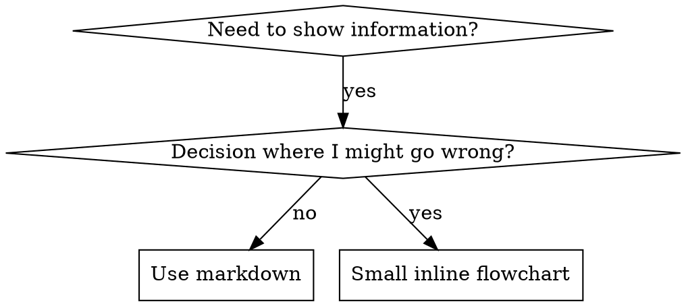

# 编写技能

## 概述

**编写技能就是把测试驱动开发应用到流程文档。**

**个人技能位于 agent-specific directories（Claude Code 使用 `~/.claude/skills`，Codex 使用 `~/.agents/skills/`）**

你编写测试用例（带 subagents 的压力场景），看它们失败（baseline behavior），编写技能（文档），看测试通过（agents comply），然后重构（关闭漏洞）。

**核心原则：**如果你没有看见 agent 在没有技能时失败，你就不知道该技能是否教了正确的东西。

**必需背景：**使用此技能前，你必须理解 superpowers:test-driven-development。该技能定义基础 RED-GREEN-REFACTOR cycle。本技能将 TDD 适配到文档。

**官方指南：**Anthropic 的官方 skill authoring best practices 见 anthropic-best-practices.md。本文档提供补充模式和指南，与本技能中 TDD-focused approach 互补。

## 什么是 Skill？

**skill** 是针对已验证技术、模式或工具的参考指南。Skills 帮助未来的 Claude 实例找到并应用有效方法。

**Skills 是：**可复用技术、模式、工具、参考指南

**Skills 不是：**关于你曾经如何解决某个问题的叙事

## 技能的 TDD 映射

| TDD 概念 | 技能创建 |
|-------------|----------------|
| **Test case** | 带 subagent 的压力场景 |
| **Production code** | 技能文档（SKILL.md） |
| **Test fails (RED)** | 没有技能时 agent 违反规则（baseline） |
| **Test passes (GREEN)** | 有技能时 agent 遵守 |
| **Refactor** | 在保持 compliance 的同时关闭漏洞 |
| **Write test first** | 编写技能前运行 baseline scenario |
| **Watch it fail** | 记录 agent 使用的精确 rationalizations |
| **Minimal code** | 编写技能来处理那些具体 violations |
| **Watch it pass** | 验证 agent 现在遵守 |
| **Refactor cycle** | 找到新 rationalizations → 堵住 → 重新验证 |

整个技能创建流程遵循 RED-GREEN-REFACTOR。

## 何时创建技能

**在以下情况创建：**
- 技术对你而言不是直觉上明显的
- 你会在多个项目中再次引用它
- 模式适用范围广（不是项目特定）
- 其他人会受益

**不要为以下情况创建：**
- 一次性解决方案
- 已在别处良好文档化的标准实践
- 项目特定约定（放进 CLAUDE.md）
- 机械约束（如果能用 regex/validation 强制，就自动化它 — 把文档留给判断类问题）

## 技能类型

### Technique
带步骤的具体方法（condition-based-waiting、root-cause-tracing）

### Pattern
思考问题的方式（flatten-with-flags、test-invariants）

### Reference
API docs、syntax guides、tool documentation（office docs）

## 目录结构


```
skills/
  skill-name/
    SKILL.md              # Main reference (required)
    supporting-file.*     # Only if needed
```

**Flat namespace** - 所有技能位于一个可搜索 namespace 中

**为以下内容使用单独文件：**
1. **Heavy reference**（100+ 行）- API docs、comprehensive syntax
2. **Reusable tools** - Scripts、utilities、templates

**保持 inline：**
- 原则和概念
- Code patterns（< 50 行）
- 其他所有内容

## SKILL.md 结构

**Frontmatter (YAML)：**
- 两个必需字段：`name` 和 `description`（所有支持字段见 [agentskills.io/specification](https://agentskills.io/specification)）
- 总计最多 1024 字符
- `name`：只使用字母、数字和 hyphens（没有 parentheses、special chars）
- `description`：第三人称，只描述何时使用（不是它做什么）
  - 以 “Use when...” 开头，聚焦触发条件
  - 包含具体 symptoms、situations 和 contexts
  - **绝不要总结技能的 process 或 workflow**（原因见 CSO 章节）
  - 尽可能保持在 500 字符以内

```markdown
---
name: Skill-Name-With-Hyphens
description: Use when [specific triggering conditions and symptoms]
---

# Skill Name

## Overview
What is this? Core principle in 1-2 sentences.

## When to Use
[Small inline flowchart IF decision non-obvious]

Bullet list with SYMPTOMS and use cases
When NOT to use

## Core Pattern (for techniques/patterns)
Before/after code comparison

## Quick Reference
Table or bullets for scanning common operations

## Implementation
Inline code for simple patterns
Link to file for heavy reference or reusable tools

## Common Mistakes
What goes wrong + fixes

## Real-World Impact (optional)
Concrete results
```


## Claude Search Optimization (CSO)

**对发现至关重要：**未来的 Claude 需要找到你的技能

### 1. 丰富的 Description 字段

**目的：**Claude 会读取 description 来决定对给定任务加载哪些技能。让它回答：“Should I read this skill right now?”

**格式：**以 “Use when...” 开头，聚焦触发条件

**关键：Description = 何时使用，而不是技能做什么**

Description 应只描述触发条件。不要在 description 中总结技能的 process 或 workflow。

**为什么重要：**测试显示，当 description 总结技能 workflow 时，Claude 可能会遵循 description，而不是读取完整技能内容。一个写着 “code review between tasks” 的 description 导致 Claude 只做一次 review，尽管技能 flowchart 清楚显示了两次 review（spec compliance 然后 code quality）。

当 description 改成只写 “Use when executing implementation plans with independent tasks”（没有 workflow summary）后，Claude 正确阅读 flowchart 并遵循两阶段 review 流程。

**陷阱：**总结 workflow 的 descriptions 会创建 Claude 会采用的 shortcut。技能正文变成 Claude 会跳过的文档。

```yaml
# ❌ BAD: Summarizes workflow - Claude may follow this instead of reading skill
description: Use when executing plans - dispatches subagent per task with code review between tasks

# ❌ BAD: Too much process detail
description: Use for TDD - write test first, watch it fail, write minimal code, refactor

# ✅ GOOD: Just triggering conditions, no workflow summary
description: Use when executing implementation plans with independent tasks in the current session

# ✅ GOOD: Triggering conditions only
description: Use when implementing any feature or bugfix, before writing implementation code
```

**内容：**
- 使用具体 triggers、symptoms 和 situations 来标记此技能适用
- 描述问题（race conditions、inconsistent behavior），而不是 language-specific symptoms（setTimeout、sleep）
- 除非技能本身是技术特定的，否则保持 triggers 技术无关
- 如果技能是技术特定的，在 trigger 中明确说明
- 使用第三人称（注入到 system prompt）
- **绝不要总结技能的 process 或 workflow**

```yaml
# ❌ BAD: Too abstract, vague, doesn't include when to use
description: For async testing

# ❌ BAD: First person
description: I can help you with async tests when they're flaky

# ❌ BAD: Mentions technology but skill isn't specific to it
description: Use when tests use setTimeout/sleep and are flaky

# ✅ GOOD: Starts with "Use when", describes problem, no workflow
description: Use when tests have race conditions, timing dependencies, or pass/fail inconsistently

# ✅ GOOD: Technology-specific skill with explicit trigger
description: Use when using React Router and handling authentication redirects
```

### 2. Keyword Coverage

使用 Claude 会搜索的词：
- Error messages：“Hook timed out”、“ENOTEMPTY”、“race condition”
- Symptoms：“flaky”、“hanging”、“zombie”、“pollution”
- Synonyms：“timeout/hang/freeze”、“cleanup/teardown/afterEach”
- Tools：实际 commands、library names、file types

### 3. Descriptive Naming

**使用主动语态、verb-first：**
- ✅ `creating-skills` 而不是 `skill-creation`
- ✅ `condition-based-waiting` 而不是 `async-test-helpers`

### 4. Token Efficiency（关键）

**问题：**getting-started 和 frequently-referenced skills 会加载进每个对话。每个 token 都重要。

**目标词数：**
- getting-started workflows：每个 <150 词
- Frequently-loaded skills：总计 <200 词
- 其他技能：<500 词（仍要简洁）

**技术：**

**将细节移动到 tool help：**
```bash
# ❌ BAD: Document all flags in SKILL.md
search-conversations supports --text, --both, --after DATE, --before DATE, --limit N

# ✅ GOOD: Reference --help
search-conversations supports multiple modes and filters. Run --help for details.
```

**使用 cross-references：**
```markdown
# ❌ BAD: Repeat workflow details
When searching, dispatch subagent with template...
[20 lines of repeated instructions]

# ✅ GOOD: Reference other skill
Always use subagents (50-100x context savings). REQUIRED: Use [other-skill-name] for workflow.
```

**压缩示例：**
```markdown
# ❌ BAD: Verbose example (42 words)
your human partner: "How did we handle authentication errors in React Router before?"
You: I'll search past conversations for React Router authentication patterns.
[Dispatch subagent with search query: "React Router authentication error handling 401"]

# ✅ GOOD: Minimal example (20 words)
Partner: "How did we handle auth errors in React Router?"
You: Searching...
[Dispatch subagent → synthesis]
```

**消除冗余：**
- 不要重复 cross-referenced skills 中已有内容
- 不要解释命令本身显而易见的内容
- 不要包含同一模式的多个示例

**验证：**
```bash
wc -w skills/path/SKILL.md
# getting-started workflows: aim for <150 each
# Other frequently-loaded: aim for <200 total
```

**按你做什么或核心洞见命名：**
- ✅ `condition-based-waiting` > `async-test-helpers`
- ✅ `using-skills` 而不是 `skill-usage`
- ✅ `flatten-with-flags` > `data-structure-refactoring`
- ✅ `root-cause-tracing` > `debugging-techniques`

**Gerunds (-ing) 适合流程：**
- `creating-skills`、`testing-skills`、`debugging-with-logs`
- 主动，描述你正在采取的行动

### 4. Cross-Referencing Other Skills

**编写引用其他技能的文档时：**

只使用技能名，并带明确 requirement markers：
- ✅ Good：`**REQUIRED SUB-SKILL:** Use superpowers:test-driven-development`
- ✅ Good：`**REQUIRED BACKGROUND:** You MUST understand superpowers:systematic-debugging`
- ❌ Bad：`See skills/testing/test-driven-development`（不清楚是否必需）
- ❌ Bad：`@skills/testing/test-driven-development/SKILL.md`（force-loads，消耗 context）

**为什么不用 @ links：**`@` 语法会立即 force-load files，在你需要之前就消耗 200k+ context。

## Flowchart Usage



**只在以下情况使用 flowcharts：**
- 非显而易见的决策点
- 你可能太早停止的 process loops
- “When to use A vs B” 决策

**绝不要为以下内容使用 flowcharts：**
- Reference material → Tables、lists
- Code examples → Markdown blocks
- Linear instructions → Numbered lists
- 没有语义意义的 labels（step1、helper2）

Graphviz style rules 见 @graphviz-conventions.dot。

**为你的人类伙伴可视化：**使用本目录中的 `render-graphs.js` 将技能 flowcharts 渲染为 SVG：
```bash
./render-graphs.js ../some-skill           # Each diagram separately
./render-graphs.js ../some-skill --combine # All diagrams in one SVG
```

## Code Examples

**一个优秀示例胜过多个平庸示例**

选择最相关的语言：
- Testing techniques → TypeScript/JavaScript
- System debugging → Shell/Python
- Data processing → Python

**好示例：**
- 完整且可运行
- 注释良好，解释为什么
- 来自真实场景
- 清晰展示模式
- 可直接适配（不是 generic template）

**不要：**
- 用 5+ 种语言实现
- 创建填空模板
- 写牵强示例

你很擅长移植 - 一个绝佳示例就够了。

## 文件组织

### Self-Contained Skill
```
defense-in-depth/
  SKILL.md    # Everything inline
```
何时：所有内容都能放下，不需要 heavy reference

### Skill with Reusable Tool
```
condition-based-waiting/
  SKILL.md    # Overview + patterns
  example.ts  # Working helpers to adapt
```
何时：Tool 是 reusable code，而不只是 narrative

### Skill with Heavy Reference
```
pptx/
  SKILL.md       # Overview + workflows
  pptxgenjs.md   # 600 lines API reference
  ooxml.md       # 500 lines XML structure
  scripts/       # Executable tools
```
何时：Reference material 太大，无法 inline

## 铁律（与 TDD 相同）

```
没有先失败的测试，就没有技能
```

这适用于新技能和对现有技能的编辑。

测试前写技能？删除它。重新开始。
不经测试编辑技能？同样违反。

**没有例外：**
- 不为“simple additions”例外
- 不为“just adding a section”例外
- 不为“documentation updates”例外
- 不要保留未测试变更作“reference”
- 不要在运行测试时“adapt”
- 删除就是删除

**必需背景：**superpowers:test-driven-development 技能解释了为什么这很重要。同样原则适用于文档。

## 测试所有技能类型

不同技能类型需要不同测试方法：

### Discipline-Enforcing Skills（规则/要求）

**示例：**TDD、verification-before-completion、designing-before-coding

**测试方式：**
- 学术问题：它们是否理解规则？
- 压力场景：它们在压力下是否遵守？
- 多重压力组合：时间 + 沉没成本 + 疲惫
- 识别 rationalizations 并添加明确 counters

**成功标准：**Agent 在最大压力下遵循规则

### Technique Skills（how-to guides）

**示例：**condition-based-waiting、root-cause-tracing、defensive-programming

**测试方式：**
- 应用场景：它们能否正确应用技术？
- 变化场景：它们是否处理边界情况？
- 缺失信息测试：指令是否有缺口？

**成功标准：**Agent 成功将技术应用到新场景

### Pattern Skills（mental models）

**示例：**reducing-complexity、information-hiding concepts

**测试方式：**
- 识别场景：它们是否识别 pattern 何时适用？
- 应用场景：它们能否使用 mental model？
- 反例：它们是否知道何时不要应用？

**成功标准：**Agent 正确识别何时/如何应用 pattern

### Reference Skills（documentation/APIs）

**示例：**API documentation、command references、library guides

**测试方式：**
- 检索场景：它们能否找到正确信息？
- 应用场景：它们能否正确使用找到的信息？
- Gap testing：是否覆盖常见用例？

**成功标准：**Agent 找到并正确应用参考信息

## 跳过测试的常见合理化

| 借口 | 现实 |
|--------|---------|
| “Skill is obviously clear” | 对你清楚 ≠ 对其他 agents 清楚。测试它。 |
| “It's just a reference” | References 也可能有缺口、不清楚章节。测试 retrieval。 |
| “Testing is overkill” | 未测试技能会有问题。总是如此。15 分钟测试节省数小时。 |
| “I'll test if problems emerge” | 问题 = agents 无法使用技能。部署前测试。 |
| “Too tedious to test” | 测试比在生产中调试坏技能更不繁琐。 |
| “I'm confident it's good” | 过度自信保证会有问题。仍要测试。 |
| “Academic review is enough” | 阅读 ≠ 使用。测试 application scenarios。 |
| “No time to test” | 部署未测试技能会浪费更多时间来修复它。 |

**所有这些都意味着：部署前测试。没有例外。**

## 针对合理化强化技能

强制纪律的技能（例如 TDD）需要抵抗合理化。Agents 很聪明，在压力下会找到 loopholes。

**心理学注记：**理解说服技术为什么有效，有助于你系统性应用它们。研究基础见 persuasion-principles.md（Cialdini, 2021; Meincke et al., 2025），涵盖 authority、commitment、scarcity、social proof 和 unity principles。

### 明确关闭每个漏洞

不要只陈述规则 - 禁止具体 workarounds：

<Bad>
```markdown
Write code before test? Delete it.
```
</Bad>

<Good>
```markdown
Write code before test? Delete it. Start over.

**No exceptions:**
- Don't keep it as "reference"
- Don't "adapt" it while writing tests
- Don't look at it
- Delete means delete
```
</Good>

### 处理“Spirit vs Letter”论证

及早添加 foundational principle：

```markdown
**Violating the letter of the rules is violating the spirit of the rules.**
```

这会切断整类“I'm following the spirit” rationalizations。

### 构建 Rationalization Table

从 baseline testing 捕捉 rationalizations（见下方 Testing section）。Agents 提出的每个借口都放进表格：

```markdown
| Excuse | Reality |
|--------|---------|
| "Too simple to test" | Simple code breaks. Test takes 30 seconds. |
| "I'll test after" | Tests passing immediately prove nothing. |
| "Tests after achieve same goals" | Tests-after = "what does this do?" Tests-first = "what should this do?" |
```

### 创建 Red Flags List

让 agents 在合理化时容易自查：

```markdown
## Red Flags - STOP and Start Over

- Code before test
- "I already manually tested it"
- "Tests after achieve the same purpose"
- "It's about spirit not ritual"
- "This is different because..."

**All of these mean: Delete code. Start over with TDD.**
```

### 为 Violation Symptoms 更新 CSO

向 description 添加你即将违反规则时的症状：

```yaml
description: use when implementing any feature or bugfix, before writing implementation code
```

## 技能的 RED-GREEN-REFACTOR

遵循 TDD cycle：

### RED：编写失败测试（Baseline）

在没有技能的情况下用 subagent 运行压力场景。记录精确行为：
- 它们做了什么选择？
- 它们使用了什么 rationalizations（逐字）？
- 哪些压力触发 violations？

这就是“看测试失败” - 你必须先看到 agents 自然会做什么，再编写技能。

### GREEN：编写最小技能

编写处理那些具体 rationalizations 的技能。不要为假想情况添加额外内容。

带技能运行相同场景。Agent 现在应该遵守。

### REFACTOR：关闭漏洞

Agent 找到新的 rationalization？添加明确 counter。重新测试，直到 bulletproof。

**测试方法论：**完整测试方法见 @testing-skills-with-subagents.md：
- 如何编写压力场景
- 压力类型（time、sunk cost、authority、exhaustion）
- 系统性堵漏洞
- Meta-testing techniques

## 反模式

### ❌ 叙事示例
“In session 2025-10-03, we found empty projectDir caused...”
**为什么不好：**太具体，不可复用

### ❌ 多语言稀释
example-js.js、example-py.py、example-go.go
**为什么不好：**质量平庸，维护负担

### ❌ Flowcharts 中的代码
```dot
step1 [label="import fs"];
step2 [label="read file"];
```
**为什么不好：**无法 copy-paste，难读

### ❌ Generic Labels
helper1、helper2、step3、pattern4
**为什么不好：**Labels 应该有语义意义

## 停止：进入下一个技能前

**写完任何技能后，你必须停止并完成部署流程。**

**不要：**
- 不测试每个技能就批量创建多个技能
- 当前技能未验证前进入下一个技能
- 因为“batching is more efficient”而跳过测试

**下面的 deployment checklist 对每个技能都是强制的。**

部署未测试技能 = 部署未测试代码。这违反质量标准。

## 技能创建检查清单（TDD Adapted）

**重要：使用 TodoWrite 为下方每个检查项创建 todos。**

**RED 阶段 - 编写失败测试：**
- [ ] 创建压力场景（discipline skills 使用 3+ combined pressures）
- [ ] 不带技能运行场景 - 逐字记录 baseline behavior
- [ ] 识别 rationalizations/failures 中的模式

**GREEN 阶段 - 编写最小技能：**
- [ ] 名称只使用字母、数字、hyphens（没有 parentheses/special chars）
- [ ] YAML frontmatter 包含必需的 `name` 和 `description` 字段（最多 1024 chars；见 [spec](https://agentskills.io/specification)）
- [ ] Description 以 “Use when...” 开头并包含具体 triggers/symptoms
- [ ] Description 使用第三人称
- [ ] 全文包含用于 search 的关键词（errors、symptoms、tools）
- [ ] 清晰 overview 和核心原则
- [ ] 处理 RED 中识别出的具体 baseline failures
- [ ] Code inline 或 link 到单独文件
- [ ] 一个优秀示例（不是多语言）
- [ ] 带技能运行场景 - 验证 agents 现在遵守

**REFACTOR 阶段 - 关闭漏洞：**
- [ ] 从测试中识别新的 rationalizations
- [ ] 添加明确 counters（如果是 discipline skill）
- [ ] 从所有测试迭代构建 rationalization table
- [ ] 创建 red flags list
- [ ] 重新测试直到 bulletproof

**质量检查：**
- [ ] 只有在决策不明显时使用小 flowchart
- [ ] Quick reference table
- [ ] Common mistakes section
- [ ] 没有 narrative storytelling
- [ ] Supporting files 只用于 tools 或 heavy reference

**部署：**
- [ ] 将技能提交到 git 并推送到你的 fork（如果已配置）
- [ ] 考虑通过 PR 贡献回去（如果广泛有用）

## 发现工作流

未来 Claude 如何找到你的技能：

1. **遇到问题**（“tests are flaky”）
3. **找到 SKILL**（description matches）
4. **扫描 overview**（这相关吗？）
5. **阅读 patterns**（quick reference table）
6. **加载 example**（只在实现时）

**为这个流程优化** - 尽早且频繁放入可搜索词。

## 底线

**创建技能就是流程文档的 TDD。**

同一铁律：没有先失败的测试，就没有技能。
同一 cycle：RED（baseline）→ GREEN（write skill）→ REFACTOR（close loopholes）。
同一收益：更好质量、更少意外、bulletproof results。

如果你对代码遵循 TDD，就对技能遵循它。这是同一纪律应用到文档。
